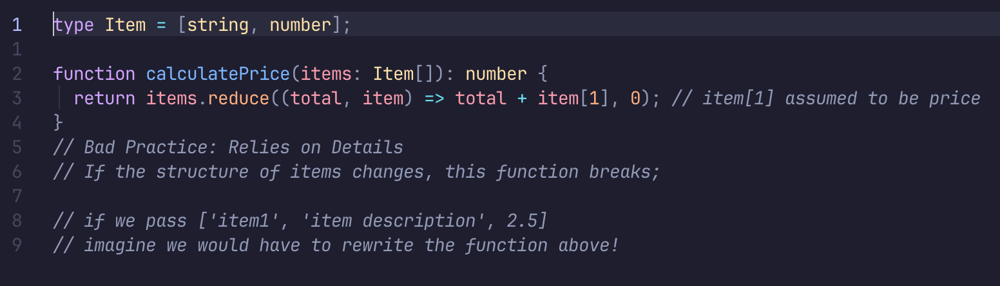
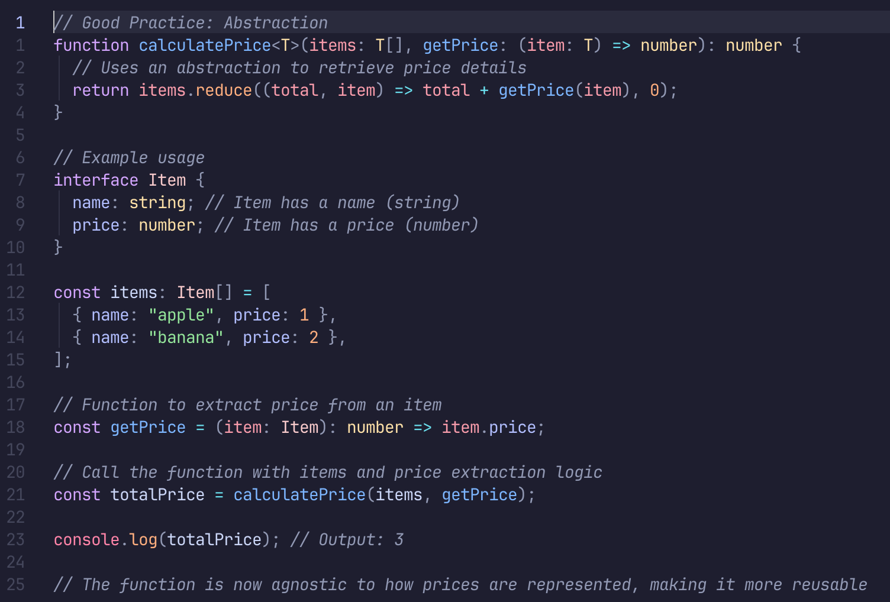

# Functions Should Avoid Relying on Implementation Details

## Example of a Function That Relies on Details

## And Here Is An Example That Is Good Because
1. It's encapsulated and its internal details are not relevant to the consumer.
2. The user interacts with its public interface: tuple of items and a 'getPrice' function:

